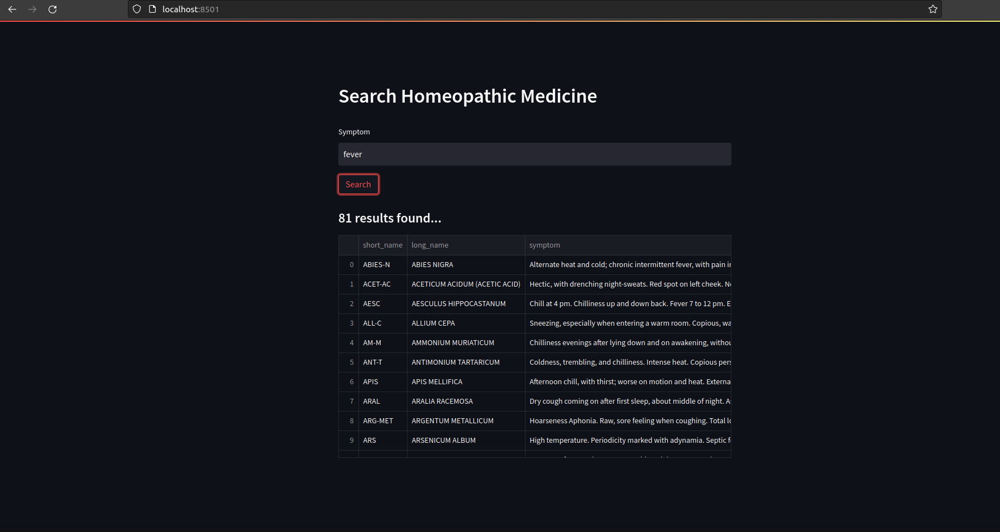

# myhomeo -  Search Homeopathic Medicines 

## Quick Start

### Build 
```console
$ chmod +x build.sh
$ ./build.sh
$ . ./venv/bin/activate
```

### Run

```console
(venv) $ python search.py

Usage: python search.py [OPTIONS]

OPTIONS:
   -symp  (str)  : Search Symptom
   -med   (str)  : Search Medicine
   -s     (bool) : Save result to file
   -v     (bool) : Enable/Disable Verbose Mode (default: disabled)
   -h     (bool) : Print this help and exit

(venv) $ python search.py -symp fever
(venv) $ python search.py -med nux
```
## Interactive Mode in Browser

```console 
(venv) $ pip install -r requirements.txt
(venv) $ streamlit run search_int.py
```

